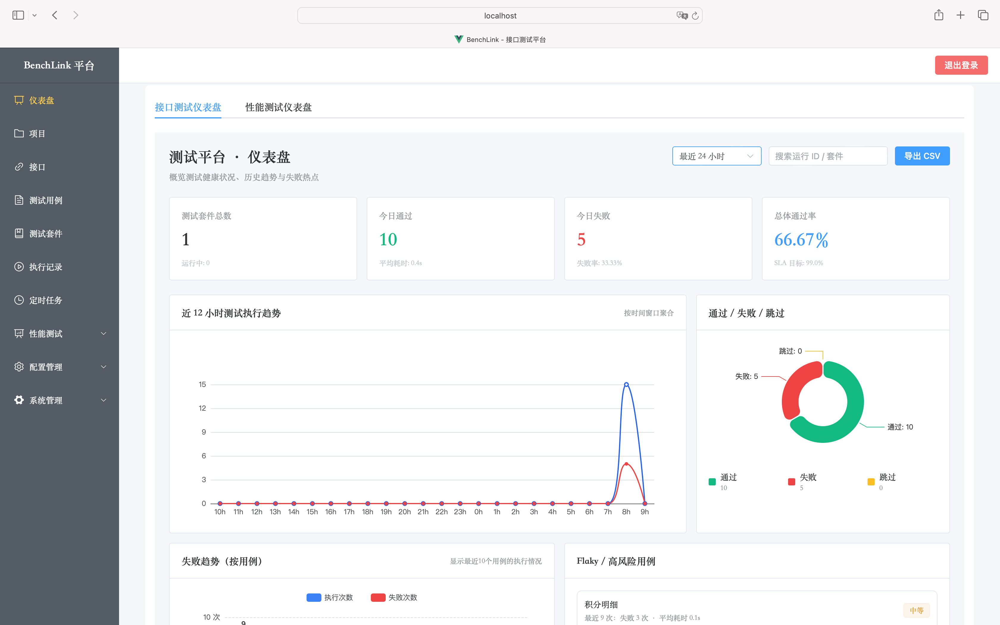
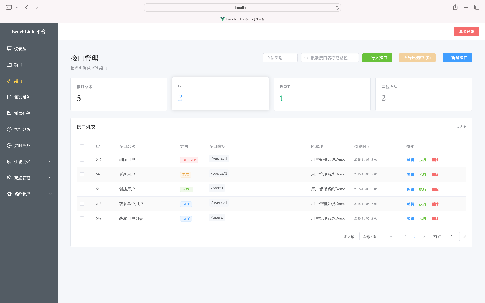
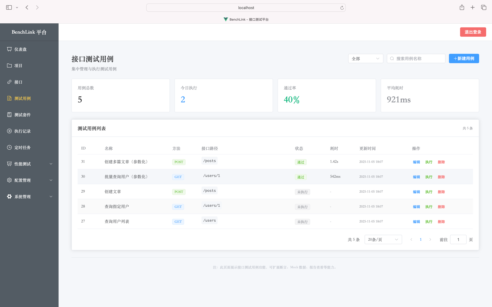
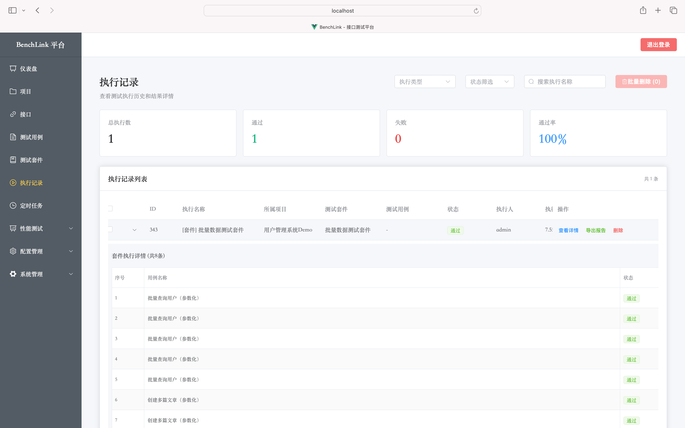
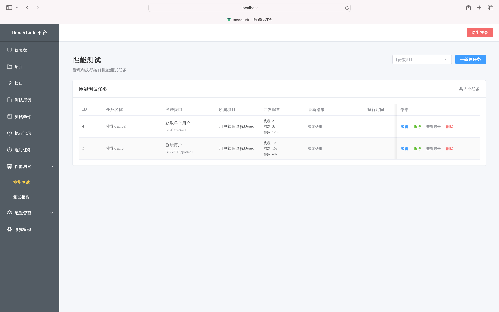

# BenchLink - 接口测试平台

<div align="center">


一个基于 Django + Vue3 的现代化接口测试平台，提供接口管理、测试用例管理、自动化测试执行和定时任务等功能。

[功能特性](#-功能特性) • [快速开始](#-快速开始) • [项目截图](#-项目截图) • [API 文档](#-api-文档)

</div>

---

## 📋 目录

- [功能特性](#-功能特性)
- [技术栈](#-技术栈)
- [项目结构](#-项目结构)
- [快速开始](#-快速开始)
- [项目截图](#-项目截图)
- [功能模块](#-功能模块)
- [API 文档](#-api-文档)
- [环境变量配置](#-环境变量配置)
- [开发计划](#-开发计划)
- [许可证](#-许可证)
- [贡献](#-贡献)

---

## ✨ 功能特性

### 核心功能

- ✅ **项目管理** - 支持多项目隔离管理，项目级别的权限控制
- ✅ **接口管理** - 完整的接口 CRUD、在线调试、批量导入导出
- ✅ **环境管理** - 支持多环境配置（开发、测试、预发布、生产等）
- ✅ **测试用例** - 支持前置/后置脚本、断言规则、参数化测试
- ✅ **测试套件** - 批量组织和管理测试用例，支持套件批量执行
- ✅ **执行记录** - 完整的测试执行历史和详细结果查看
- ✅ **定时任务** - 基于 Cron 表达式的定时测试执行
- ✅ **性能测试** - 基于 Locust 的接口性能测试和压力测试
- ✅ **用户权限** - 基于 Token 的用户认证和权限管理
- ✅ **通知系统** - 支持邮件、企业微信、钉钉等多种通知方式
- ✅ **API 文档** - 自动生成的 Swagger/OpenAPI 文档，支持在线调试

### 高级特性

- 🔄 **接口导入导出** - 支持 Postman Collection、Swagger/OpenAPI 格式
- 📊 **数据可视化** - 基于 ECharts 的测试数据统计和趋势分析
- 🎯 **参数化测试** - 支持数据驱动测试，批量数据自动执行
- 🔐 **全局 Token 管理** - 统一管理各环境的认证 Token
- 📝 **测试报告** - 详细的测试执行报告，支持导出
- ⚡ **异步执行** - 基于 Celery 的异步任务执行，支持并发测试

---

## 🛠 技术栈

### 后端

- **框架**: Django 4.2.7
- **API**: Django REST Framework 3.14.0
- **数据库**: MySQL / PostgreSQL（支持）
- **缓存/消息队列**: Redis 5.0.1
- **异步任务**: Celery 5.3.4
- **定时任务**: APScheduler 3.10.4
- **性能测试**: Locust 2.17.0+
- **API 文档**: drf-spectacular 0.27.2
- **认证**: JWT (djangorestframework-simplejwt)

### 前端

- **框架**: Vue 3.3.4
- **路由**: Vue Router 4.2.5
- **状态管理**: Pinia 2.1.7
- **UI 组件**: Element Plus 2.4.4
- **图表**: ECharts 6.0.0 + vue-echarts
- **构建工具**: Vite 5.0.7
- **HTTP 客户端**: Axios 1.6.2

---

## 📁 项目结构

```
BenchLink/
├── backend/                    # Django 后端
│   ├── apps/                   # 应用模块
│   │   ├── apis/               # 接口管理
│   │   ├── environments/      # 环境管理
│   │   ├── executions/         # 执行记录
│   │   ├── notifications/     # 通知系统
│   │   ├── projects/           # 项目管理
│   │   ├── scheduler/          # 定时任务
│   │   ├── testcases/          # 测试用例
│   │   ├── testsuites/         # 测试套件
│   │   └── users/              # 用户管理
│   ├── BenchLink/              # 项目配置
│   │   ├── settings.py         # Django 配置
│   │   ├── urls.py             # URL 路由
│   │   └── celery.py           # Celery 配置
│   ├── requirements.txt        # Python 依赖
│   └── manage.py               # Django 管理脚本
├── frontend/                    # Vue3 前端
│   ├── src/
│   │   ├── api/                # API 接口封装
│   │   ├── components/         # 公共组件
│   │   ├── layouts/            # 布局组件
│   │   ├── router/             # 路由配置
│   │   ├── store/              # 状态管理
│   │   └── views/              # 页面组件
│   ├── package.json            # 前端依赖
│   └── vite.config.js          # Vite 配置
├── docker/                      # Docker 配置
│   ├── docker-compose.yml      # Docker Compose 配置
│   ├── backend.Dockerfile      # 后端镜像
│   └── frontend.Dockerfile     # 前端镜像
├── screenshots/                 # 项目截图
├── README.md                    # 项目说明
└── scripts/                     # 脚本文件
```

---

## 🚀 快速开始

### 方式一：Docker Compose（推荐）

```bash
# 启动所有服务
docker-compose -f docker/docker-compose.yml up -d

# 初始化数据库
docker-compose -f docker/docker-compose.yml exec backend python manage.py migrate
docker-compose -f docker/docker-compose.yml exec backend python manage.py createsuperuser
```

访问：
- 前端：http://localhost
- 后端API：http://localhost:8000
- Swagger 文档：http://localhost:8000/api/docs/swagger/
- 管理后台：http://localhost:8000/admin

### 方式二：本地开发

#### 后端设置

```bash
cd backend

# 创建虚拟环境
python -m venv venv
source venv/bin/activate  # Windows: venv\Scripts\activate

# 安装依赖
pip install -r requirements.txt

# 配置环境变量
cp env.example .env  # 创建 .env 文件并配置数据库等信息

# 数据库迁移
python manage.py migrate

# 创建超级用户
python manage.py createsuperuser

# 启动开发服务器
python manage.py runserver
```

#### 前端设置

```bash
cd frontend

# 安装依赖
npm install

# 启动开发服务器
npm run dev
```

访问：
- 前端：http://localhost:5173
- 后端API：http://localhost:8000
- Swagger 文档：http://localhost:8000/api/docs/swagger/

---

## 📸 项目截图

### 仪表盘

展示测试统计、执行趋势等关键指标。



### 接口管理

集中管理所有 API 接口，支持导入导出、在线调试。



**主要功能**：
- 接口列表管理（支持按方法、项目筛选）
- 接口统计（总数、GET、POST、其他方法）
- 接口导入（支持 Postman、Swagger/OpenAPI 格式）
- 接口导出（批量导出选中接口）
- 接口在线调试和执行

### 测试用例

管理和执行单个测试用例，支持前置/后置脚本、断言配置。



**主要功能**：
- 测试用例列表
- 用例统计（总数、今日执行、通过率、平均耗时）
- 新建/编辑/删除用例
- 用例执行（单个或批量）
- 参数化测试支持

### 执行记录

查看所有测试执行的历史记录和详细结果。



**主要功能**：
- 执行记录列表（支持按类型、状态筛选）
- 执行统计（总执行数、通过数、失败数、通过率）
- 执行详情查看（包括套件执行详情、用例执行详情）
- 执行报告导出

### 性能测试

管理和执行接口性能测试任务，基于 Locust 进行压力测试。



**主要功能**：
- 性能测试任务列表
- 并发配置（线程数、启动时间、持续时间）
- 任务执行和结果查看
- 性能测试报告

---

## 🎯 功能模块

### 1. 项目管理

- 多项目隔离管理
- 项目成员管理
- 项目统计信息
- 项目级别的权限控制

### 2. 接口管理

- 接口 CRUD 操作
- 接口导入导出（Postman、Swagger/OpenAPI）
- 接口在线调试
- 接口参数化配置
- 接口文件上传支持

### 3. 环境管理

- 多环境配置（开发、测试、预发布、生产）
- 环境变量管理
- 全局 Token 管理
- 环境切换功能

### 4. 测试用例

- 用例创建和编辑
- 前置/后置脚本配置
- 断言规则配置
- 参数化测试
- 用例执行和结果查看

### 5. 测试套件

- 套件创建和管理
- 用例批量组织
- 套件批量执行
- 执行顺序配置

### 6. 执行记录

- 执行历史记录
- 详细执行结果查看
- 执行报告导出
- 执行统计和分析

### 7. 定时任务

- Cron 表达式配置
- 任务启用/禁用
- 任务执行历史
- 任务通知配置

### 8. 性能测试

- 基于 Locust 的性能测试
- 并发配置（用户数、启动速率、持续时间）
- 实时性能指标
- 性能报告生成

### 9. 用户管理

- 用户创建和编辑
- 角色权限管理
- 用户状态管理

### 10. 通知系统

- 邮件通知
- 企业微信通知
- 钉钉通知
- 通知模板配置

---

## 📚 API 文档

启动后端服务后，访问以下地址：

- **Swagger UI**：http://localhost:8000/api/docs/swagger/ （推荐，可视化接口文档）
- **OpenAPI Schema**：http://localhost:8000/api/schema/ （JSON 格式）
- **API 根路径**：http://localhost:8000/ （返回 API 端点索引）
- **Django Admin**：http://localhost:8000/admin/

### 主要 API 端点

| 端点 | 说明 |
|------|------|
| `/api/users/` | 用户管理 |
| `/api/projects/` | 项目管理 |
| `/api/environments/` | 环境管理 |
| `/api/apis/` | 接口管理 |
| `/api/testcases/` | 测试用例 |
| `/api/testsuites/` | 测试套件 |
| `/api/executions/` | 执行记录 |
| `/api/scheduler/` | 定时任务 |
| `/api/notifications/` | 通知管理 |

---

## ⚙️ 环境变量配置

在 `backend/` 目录下创建 `.env` 文件：

```env
# Django 配置
SECRET_KEY=your-secret-key-here
DEBUG=True
ALLOWED_HOSTS=localhost,127.0.0.1

# 数据库配置
DB_NAME=benchlink
DB_USER=root
DB_PASSWORD=your-password
DB_HOST=localhost
DB_PORT=3306

# Redis 配置（Celery）
CELERY_BROKER_URL=redis://localhost:6379/0
CELERY_RESULT_BACKEND=redis://localhost:6379/0

# 邮件配置（可选）
EMAIL_HOST=smtp.example.com
EMAIL_PORT=587
EMAIL_HOST_USER=your-email@example.com
EMAIL_HOST_PASSWORD=your-password
EMAIL_USE_TLS=True
```

---

## 📅 开发计划

### 已完成 ✅

- [x] 接口导入/导出（Postman、Swagger等格式）
- [x] 性能测试支持（基于 Locust）
- [x] 通知系统（邮件、企业微信、钉钉等）
- [x] API 文档（Swagger/OpenAPI）
- [x] 参数化测试
- [x] 测试报告生成

### 计划中 🚧

- [ ] 测试报告导出（HTML、PDF）
- [ ] 数据 Mock 功能
- [ ] 测试数据管理
- [ ] 更丰富的断言类型
- [ ] 团队协作功能（评论、审批流程）
- [ ] CI/CD 集成（Jenkins、GitLab CI）
- [ ] 缺陷系统集成（Jira、禅道）
- [ ] 操作日志和审计
- [ ] 多语言支持

---

## 📄 许可证

MIT License

---

## 🤝 贡献

欢迎提交 Issue 和 Pull Request！

### 贡献指南

1. Fork 本仓库
2. 创建特性分支 (`git checkout -b feature/AmazingFeature`)
3. 提交更改 (`git commit -m 'Add some AmazingFeature'`)
4. 推送到分支 (`git push origin feature/AmazingFeature`)
5. 开启 Pull Request

---

## 📞 联系方式

- **GitHub**: [https://github.com/lispkaka/BenchLink](https://github.com/lispkaka/BenchLink)
- **Gitee**: [https://gitee.com/yongens/bench-link](https://gitee.com/yongens/bench-link)

---

<div align="center">

**如果这个项目对你有帮助，请给个 ⭐ Star！**

Made with ❤️ by BenchLink Team

</div>
